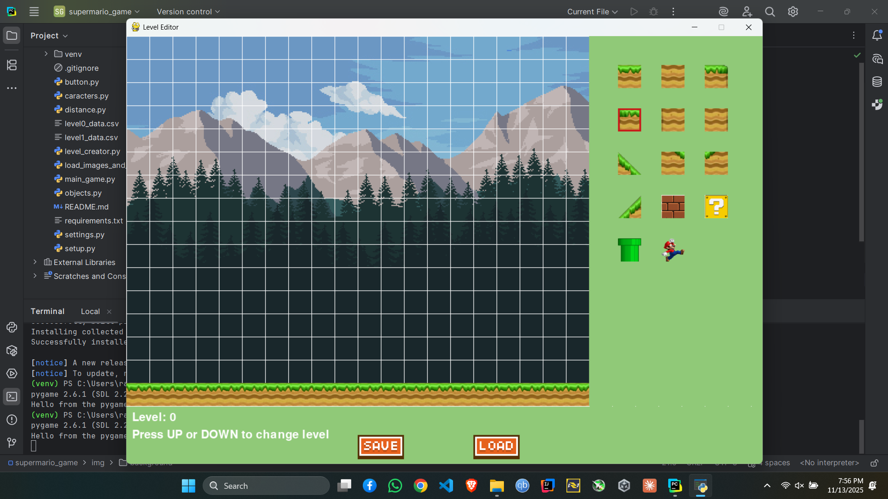
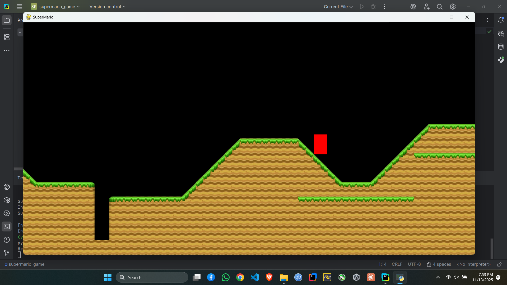
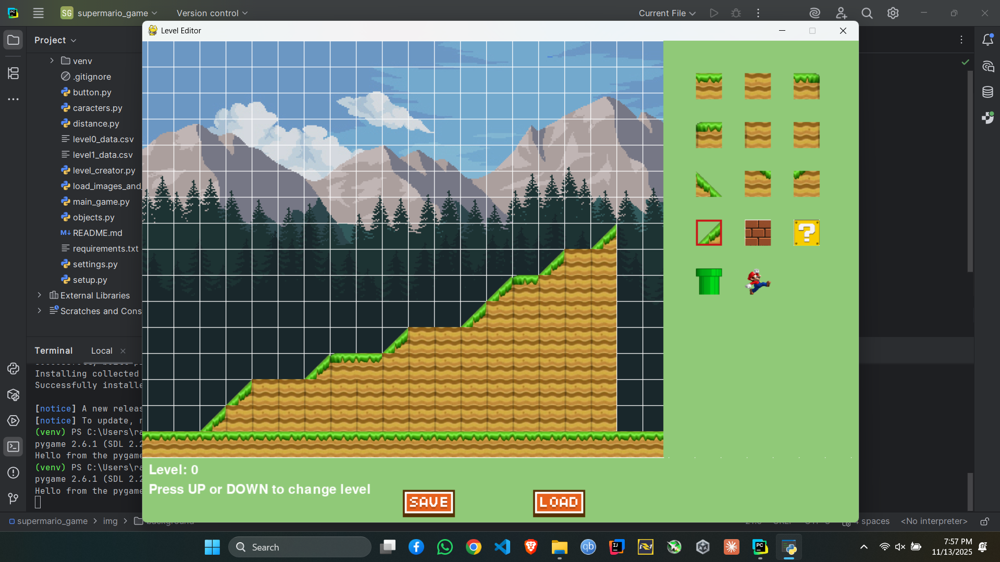
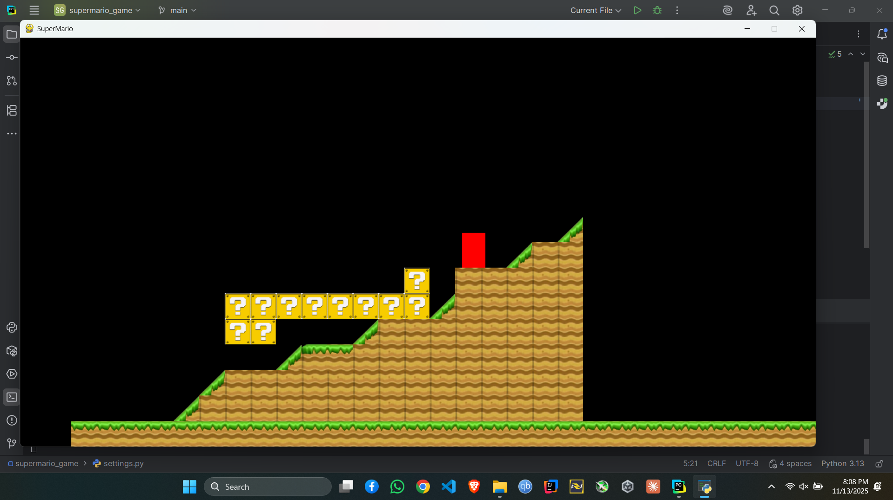

# Super Mario Clone – Homemade Python Platformer

A fully playable **Super Mario-inspired 2D platformer** I built from scratch in Python using Pygame.

Features real slope/ramp physics, smooth scrolling, a working level editor, and that classic Mario feel!

## Features

* Precise Mario movement & physics
* Custom slope collision (left & right ramps!)
* Infinite horizontal scrolling world
* Built-in **Level Editor** (`level_creator.py`) with save/load
* Clean OOP structure with sprites, masks, and groups
* Multiple levels via CSV system

## How to Run (2025 – Python 3.13)

```bash
python -m venv venv

# Windows
venv\Scripts\activate
# macOS/Linux
source venv/bin/activate

pip install pygame==2.6.1

python main_game.py
```

### Controls

← → : Move
SPACE : Jump
Works on ramps too!

### Level Editor (`level_creator.py`)

Run it separately to design new levels:

```bash
python level_creator.py
```

Left click → place selected tile
Right click → erase
Arrow keys → scroll map
UP/DOWN → change level number
Save/Load buttons at the bottom

## Screenshots

| Level Editor (design your own worlds!) | In-Game (classic Mario vibes with ramps!) |
|----------------------------------------|-------------------------------------------|
|  |  |
|  |  |

> The red rectangle is your Mario — easy to spot while testing physics!  
> Full level editor included: draw tiles, save/load levels, infinite horizontal worlds.


### Folder Structure

```
img/                ← All tiles & background assets
preloaded_levels/   ← Your finished levels (CSV)
*.py                ← Game code
level*_data.csv     ← Generated level files
```

Made with love in 2022–2023, revived in 2025
Never forget how to run it again!

### 5. GitHub Repository Description (short & perfect)

Homemade Super Mario platformer in Python + Pygame – with ramps, scrolling, and a full level editor!

### Project Tree

```
supermario_game/
├── .gitignore
├── requirements.txt
├── README.md
├── main_game.py          ← run this!
├── level_creator.py      ← your awesome editor
├── settings.py
├── setup.py
└── img/, preloaded_levels/, etc.
```
