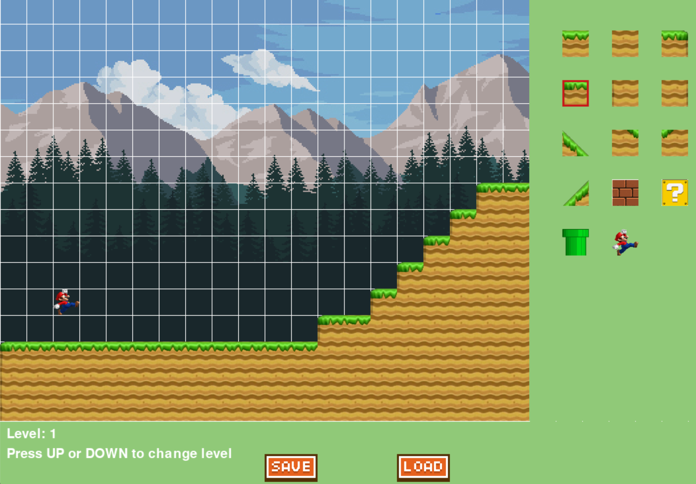

# Super Mario Clone – Homemade Python Platformer

A fully playable **Super Mario-inspired 2D platformer** built from scratch in Python + Pygame — complete with **custom slope/ramp physics**, infinite scrolling, and a **full level editor**!

Made in 2022–2023, revived and running perfectly on **Python 3.13 in 2025**

## Features

* Precise Mario movement & physics (with ramp walking!)
* Infinite horizontal world (300+ tiles wide)
* Custom slope collision (left & right ramps)
* Built-in **Level Editor** with save/load
* Clean OOP structure
* Multiple levels via CSV

## Screenshots

| Gameplay (Red Mario = debug mode)         | Classic hills & ramps in action           |
| ----------------------------------------- | ----------------------------------------- |
|  |  |

| Level Editor – Full tile selector                 | Building a massive ramp level                     |
| ------------------------------------------------- | ------------------------------------------------- |
|  |  |

| Level Editor – Save/Load buttons                  | Ready to design your dream level!                 |
| ------------------------------------------------- | ------------------------------------------------- |
|  |  |

> The red rectangle is Mario (easy to see during testing). Replace with real sprites later if you want!

## How to Run

```bash
# Clone & enter folder
cd supermario_game

# Setup (one time)
python -m venv venv
venv\Scripts\activate        # Windows
# source venv/bin/activate    # macOS/Linux
pip install pygame==2.6.1

# Run the game
python main_game.py
```

### How to Run Different Levels

Your game loads levels from level{X}_data.csv files.

#### Method 1: Quick Change (Recommended)

Open `settings.py`
Change this line:

```python
level = load_level(x=1)   # ← change the number!
```

Examples:

* Level 0 → x=0
* Level 1 → x=1 (default)
* Level 4 → x=4

Save → Run `python main_game.py`

#### Method 2: Use the Level Editor (Best for creating new levels)

```bash
python level_creator.py
```

### Editor Controls

↑ ↓ Arrows → Change level number (Level: 0, 1, 2, 4...)
← → Arrows → Scroll the huge map
Left Click → Place selected tile
Right Click → Erase tile
SAVE → Creates `level{X}_data.csv`
LOAD → Loads existing level

💡 **Pro Tip:** Build Level 2 → Save → Edit `settings.py` → `x=2` → Play your new level!

### Level File Rules

* Files: `level0_data.csv`, `level1_data.csv`, etc.
* Tile 13 = Mario spawn point (place exactly one!)
* Bottom row auto-fills with ground in editor

### Controls

← → → Move
SPACE → Jump (works on ramps too!)

### Folder Structure

```
img/                  → Tiles & background
screenshots/          → Pretty pictures
preloaded_levels/     → Backup level templates
level*_data.csv       → Your saved levels
```

Made with love in 2022, still running strong in 2025
